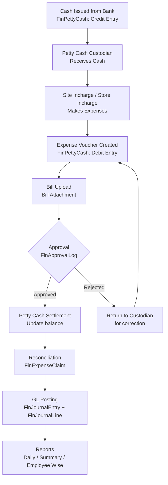
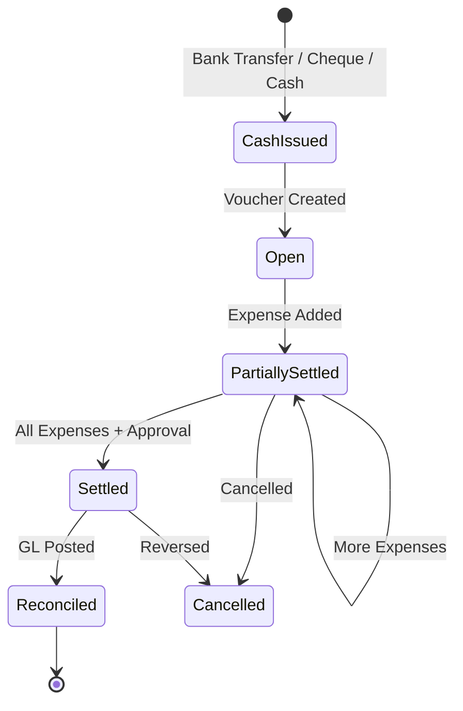
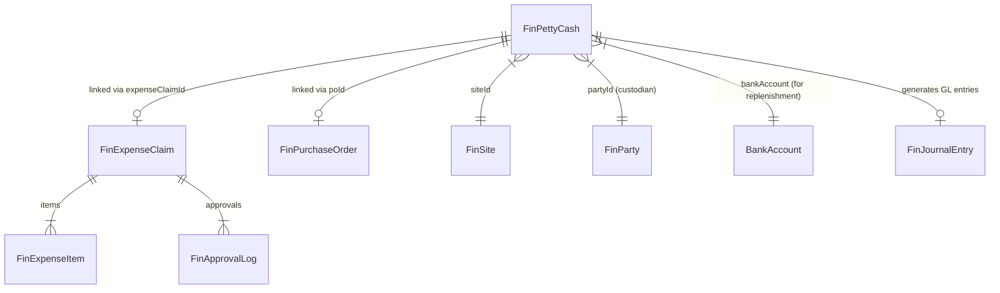
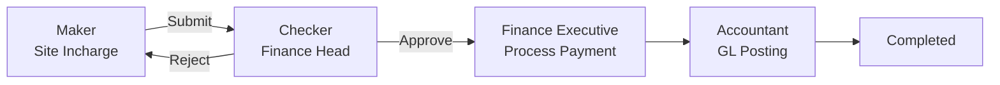
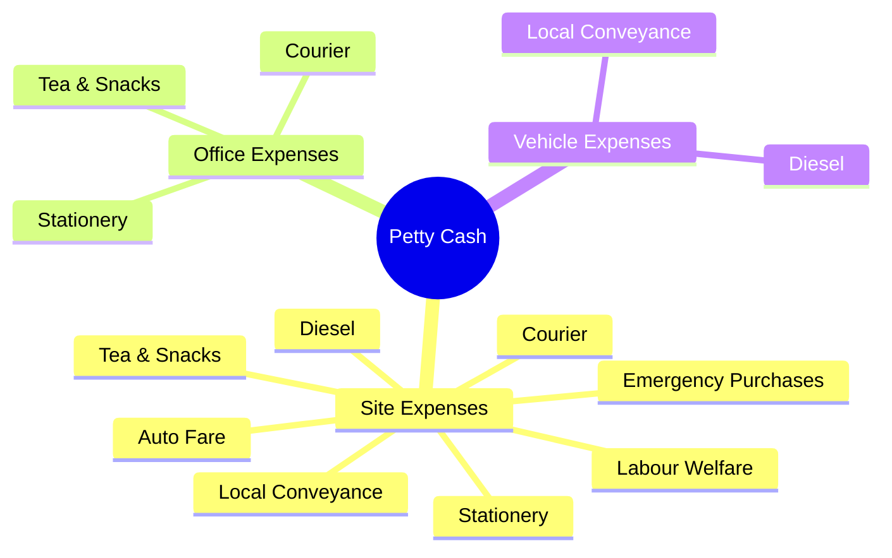

# Petty Cash Management — Flow Diagram

## 1. Process Flow

## 2. Detailed State Machine

## 3. Data Flow (Entities)

## 4. Daily Cash Report Format

| Date | Opening Balance | Cash Issued | Expenses | Closing Balance |
|------|----------------|-------------|----------|-----------------|
| 2025-01-15 | 50,000 | 20,000 | 5,000 | 15,000 |
| 2025-01-16 | 15,000 | 10,000 | 3,500 | 11,500 |

## 5. Petty Cash Summary (Site Wise)

| Site Code | Site Name | Cash Given | Expenses | Balance |
|-----------|-----------|------------|----------|---------|
| SITE-001 | Kalisindh | 50,000 | 35,000 | 15,000 |
| SITE-002 | Mundra | 30,000 | 28,000 | 2,000 |

## 6. Employee Wise Settlement

| Employee | Advance | Expenses | Balance |
|----------|---------|----------|---------|
| Rajesh Kumar | 5,000 | 4,500 | 500 |
| Amit Patel | 3,000 | 3,000 | 0 |

## 7. Approval Workflow

## 8. Petty Cash Categories

## 9. Limits & Controls

| Role | Limit Authority |
|------|----------------|
| Site Incharge | Up to ₹5,000 |
| Store Incharge | Up to ₹10,000 |
| Admin Executive | Up to ₹25,000 |
| Finance Head | Above ₹25,000 |

## 10. Integration Points

| Module | Integration |
|--------|-------------|
| **Bank & Cash** | Cash Issued from Bank → Petty Cash |
| **Accounts Payable** | Payment to Vendor via Petty Cash |
| **Expense Claims** | Petty Cash linked to Expense Claims |
| **Purchase Orders** | Emergency Purchases linked to PO |
| **General Ledger** | Auto-posting to GL on settlement |
| **Taxation** | GST on petty cash purchases tracked via `FinTdsDeduction` |
